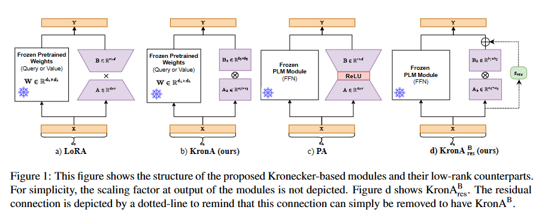

# KronA: Parameter Efficient Tuning with Kronecker Adapter
## 摘要
在特定的下游任务上微调预训练语言模型 （PLM） 一直是自然语言处理中众所周知的范式。 然而，随着 PLM 规模的不断扩大，在多个下游任务上训练整个模型变得非常昂贵且耗费大量资源。最近，提出了不同的参数高效调优 （PET） 技术来提高微调 PLM 的效率。 PET 方法的一个流行类别是低秩自适应方法，它将可学习的截断 SVD 模块按顺序或并行插入到原始模型中。 然而，低秩分解的代表权有限。在这项工作中，我们使用 Kronecker 积而不是低秩表示来解决这个问题。 我们推出了 KronA，这是一款基于 Kronecker 产品的适配器模块，用于对基于 Transformer 的 PLM 进行高效微调。我们在 GLUE 基准测试中应用了所提出的微调 T5 方法，以表明采用基于 Kronecker 的模块可以胜过最先进的 PET 方法。
## 介绍
大型 PLM 被用作各种 NLP 任务中的骨干模型，以实现最先进的结果（Devlin 等人，2019 年;Radford等人，2019）。这些大型预训练模型通过上下文学习或模型参数的微调来适应下游应用。上下文学习在推理过程中会带来大量的内存和计算开销，因为必须为每个样本处理所有训练样本（Liu et al.， 2022）。另一方面，对整个模型进行全面微调 （FT） 既可以减少推理延迟，又可以提高准确性。然而，随着这些模型变得越来越大，对其参数进行全面微调变得更具挑战性。此外，还必须为每个下游应用程序存储整个模型检查点，这使得不同任务之间的部署和切换效率极低。

为了应对这些挑战，一些工作建议插入少量可训练参数，同时冻结大部分（甚至全部）预训练模型参数。这大大降低了微调的内存和计算要求。此外，可以为每个任务存储一小组调整参数，而不是存储整个模型的一个副本。我们将这些方法称为PET方法。

在PET方法中，软提示（Li和Liang，2021;Lester 等人，2021a） 将可训练参数预置到层的输入中。嵌入层长度的增加会导致推理过程中的计算开销很大。

在另一类PET方法中，插入适配器模块（Houlsby等人，2019;Karimi Mahabadi 等人，2021 年;He et al.， 2022）进入变形金刚。适配器是低等级模块，由向上投影和向下投影组成。 这些方法的一个局限性是，它们会增加推理过程中的计算开销和延迟，这使得它们在延迟关键型方案中效率低下。

因此，开发了低秩自适应 （LoRA） （Hu et al.， 2021），该算法也使用超低秩模块作为可训练参数。但是，一旦进行微调，特定于任务的参数就可以与原始预训练模型权重合并，从而使推理的延迟和能量需求保持不变。尽管推理速度很快，但与完全微调相比，LoRA 通常精度会下降.这是因为其低等级结构对特定于任务的更新施加了强有力的假设。

克罗内克乘积分解是另一种不依赖于低秩假设的因式分解方法。 这种强大的分解方法在用于模型压缩时具有已被证明优于低秩分解方法（Thakker 等人，2019 年;Hameed 等人，2021 年）。它还已成功用于压缩基于 Transformer 的语言模型（Tahaei 等人，2021 年;Edalati 等人，2021 年）。

受到 Kronecker 分解无处不在的成功启发，在这项工作中，我们用 Kronecker 产品分解替换了 LoRA 中的低秩分解，以开发 Kronecker 适配器 （KronA）。我们表明，这种简单的修改可以在不增加推理延迟的情况下提高准确性。此外，对于可以容忍延迟增加的应用程序，我们建议使用 KronA .该模块是 KronA 的一个版本，旨在与前馈网络 （FFN） 模块并行使用，与通用语言理解评估 （GLUE） 基准的全面微调相比，实现了显着改进（Wang 等人，2018 年）。此外，当将建议的可学习残差连接添加到 KronA 中时，开发 KronA 以获得更好的结果。

我们在GLUE基准（Wang等人，2018）上评估了我们的方法，以研究Kronecker产品对性能的影响。总而言之，我们的贡献是：
* 提出 KronA，一个 Kron ecker A dapter 模块，可以并行插入权重矩阵，适用于延迟关键场景。
* 将 KronA 模块与 FFN 模块 （ KronA ） 以及可学习的残差连接 （ KronA ） 并行使用，以增加推理延迟为代价进一步提高准确性。
* 在GLUE分数、训练时间和推理延迟方面，与最先进的方法相比，对方法进行评估。

## Method

