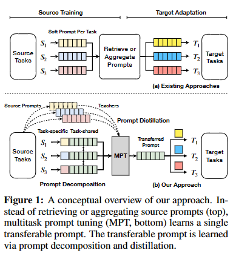
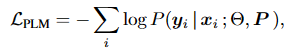
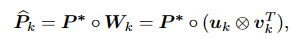
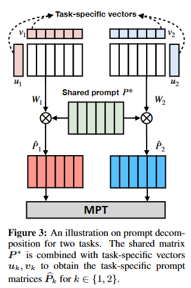
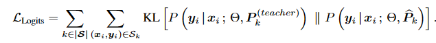

# MULTITASK PROMPT TUNING 
## 摘要
提示调优，其中基础预训练模型通过对学习的提示向量进行调节来适应每个任务，已成为一种很有前途的方法，可以有效地使大型语言模型适应多个下游任务。然而，现有方法通常从头开始学习软提示向量，并且尚不清楚如何在多任务学习环境中利用提示向量利用丰富的跨任务知识。我们提出了多任务提示调优 （MPT），它首先通过从多个特定于任务的源提示中提取知识来学习单个可转移的提示。然后，我们学习对这个共享提示的乘法低秩更新，以有效地使其适应每个下游目标任务。对 23 个 NLP 数据集的广泛实验表明，我们提出的方法优于最先进的方法，包括在某些情况下的完整微调基线，尽管只调谐了 0 .035% 的任务特定参数。
## 介绍
对预训练语言模型 （PLM） 的微调导致了各种下游 NLP 任务的显着改进（Devlin 等人，2019 年;Howard & Ruder，2018 年;Raffel 等人，2020 年）。然而，鉴于现代 PLM 可能拥有数亿（甚至数十亿）个参数，因此传统的全任务特定微调 （FT） 范式很难扩展到多个任务。因此，人们对开发参数高效的模型调整方法越来越感兴趣（Houlsby 等人，2019 年;Lester 等人，2021 年;Ding 等人，2022 年），目标是在每个任务中仅学习少量附加参数，同时实现与完全微调相当的性能。

提示调优 （PT） 在输入中预置可调连续提示向量，已成为使用 PLM 进行参数高效迁移学习的一种有前途的方法（Liu 等人，2021a;Li & Liang，2021 年;Lester 等人，2021 年;Liu 等人，2022b;2021b）. PT 冻结了 PLM 参数，只学习了一小部分特定于任务的提示向量。然而，尽管它们的性能令人印象深刻，但快速调优和完全微调之间仍然存在很大差距（Lester 等人，2021 年）。此外，这种方法对初始化很敏感，通常比微调需要更多的训练时间（Su 等人，2022 年;Zhong 等人，2022 年）。

最近的工作建议通过从各种任务中转移提示向量来解决这些问题（Su 等人，2022 年;Zhong 等人，2022 年）。这些方法首先在多个源任务上训练软提示，然后使用这些预训练的提示来初始化提示，以便根据（可能学习的）相似性度量对目标任务进行进一步微调（Vu 等人，2022 年;Asai 等人。

在本文中，我们扩展了这一工作范围，并引入了**多任务提示调优 （MPT），它使用多任务数据来学习可以有效地转移到目标任务的单个提示**。虽然在概念上很简单，但学习共享提示空间实际上可能具有挑战性，因为它需要学习不同源任务的共性，同时最大限度地减少干扰。因此，**我们将每个源任务的软提示（可以表示为提示矩阵）分解为共享矩阵和低秩任务特定矩阵的乘法**，发现这种分解比简单地在所有任务之间共享提示矩阵更有效。 这种分解是通过从常规提示调整中获得的软提示中进行知识提炼来学习的。为了转移到新任务，我们对共享提示矩阵执行低秩乘法更新。
## 方法
给定一组源任务 S = {S， S ， ...， S} 和目标任务 T = {T， T ， ...， T } ，我们的目标是在 S 上学习一个软提示，该软提示可以以参数有效的方式适应每个任务 T。简单地在 S 上训练一个软提示，然后对每个 T 进行微调是次优的，因为它可能无法利用源任务之间的共性，同时最大限度地减少干扰。为此，多任务提示调优 （MPT） 旨在通过知识蒸馏将 S 中的任务共享知识压缩到单个提示矩阵中φ以提高 T 上的性能，同时过滤掉对迁移学习不太有用的任务特定信息。

提示调整。 给定一个参数为 Θ 的预训练语言模型和一个训练数据 （ X ， Y ） = { x ， y } 的目标任务 T，标准方法是通过最大化条件概率 P （ Y |X ;Θ），在考虑一组目标任务 T 时，参数效率可能低下。一种参数效率更高的替代方案是提示调整 （PT），它随机初始化少量可学习的提示向量（即软提示），以附加到 PLM 的输入嵌入之前，同时冻结模型参数 Θ（Lester 等人，2021 年;Liu 等人，2022b）。从形式上讲，对于令牌嵌入为 T = [ t ， t ， ...， t ] ∈ R 的输入标记序列，PT 在可学习的提示矩阵 P ∈ R 前面加上一个与标记嵌入 d 具有相同维度的可学习提示矩阵 P，其中 l 是超参数。然后，PT 对 P 优化了以下损失函数：

## MULTITASK PROMPT TUNING
我们提出的框架被称为MPT，由两个阶段组成：源训练和目标适应。

MPT首先专注于源训练，以生成单个软提示矩阵，以便在第二阶段重新使用以进行目标任务自适应。具体而言，源任务的提示矩阵被分解为任务共享矩阵和低秩任务专用矩阵（提示分解），其中前者在所有任务中共享。这种分解为共享和特定任务的组件是通过知识提炼来学习的。一旦学习，共享提示矩阵通过低秩乘法更新适用于下游目标任务。

**Prompt decomposition**：即时分解的目标是实现跨源任务S的有效知识共享，同时仍然允许每个任务保持其自己的参数来编码特定于任务的知识。我们将第k个任务的软提示Pk分解为两部分，如图3所示。设P* ∈Rl×d表示所有任务的共享提示，进一步设uk∈Rl，vk∈Rd是每个任务的特定向量
任务k。任务特定向量形成秩一矩阵Wk=uk⊗vT k，其具有与共享提示P*相同的维度。然后将第k个源任务的任务提示-P参数化为：

**Prompt distillation**：直接从多任务数据集S学习即时分解往往会使共享组件P* 过度适应更大的任务。我们发现，从单独训练的源提示中提取知识是学习良好的可分解提示的有效策略。具体来说，我们首先通过传统的提示调谐获得第k个源任务的教师提示P（教师）k。 然后，我们随机初始化一个相应的学生提示，使其为Pk=P*◦（uk⊗vTk），其中所有学生提示共享P*，并具有自己的任务特定向量，如上所述。然后，我们使用蒸馏将跨任务知识转移到共享提示矩阵中（Sanh et al.，2019）。第一个损失是通过最小化学生和教师关于共享提示矩阵P*和任务特定参数uk和vk的KL散度来匹配他们的输出概率分布：

## 结论
我们介绍并研究了多任务提示调优（MPT），它通过从多个源任务及其特定任务的源提示中分解和提取知识来学习单个可转移提示。MPT将任务提示分解为共享提示矩阵和秩一任务特定矩阵的Hadamard乘积。然后，共享组件被转移并适应于用于进一步调整的目标任务。根据经验，我们发现这种方法能够在不同的NLP基准上实现针对下游任务的参数高效迁移学习，在某些情况下甚至优于完全微调基线，尽管调整的特定任务参数要少得多。
