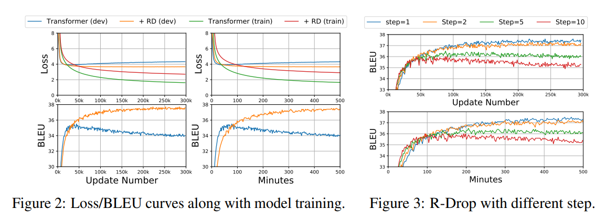

# R-Drop Regularized Dropout for Neural Networks
## 摘要
Dropout 是一种功能强大且广泛使用的技术，用于规范化深度神经网络的训练。虽然有效且性能良好，但doupout引入的随机性会导致训练和推理之间不可忽视的不一致。在本文中，我们引入了一种简单的一致性训练策略来正则化 dropout，即 R-Drop，它迫使 dropout 生成的不同子模型的输出分布彼此一致。具体来说，**对于每个训练样本，R-Drop 最小化了通过 dropout 采样的两个子模型的输出分布之间的双向 KL 散度**。理论分析表明，R-Drop减少了上述不一致。对神经机器翻译、抽象总结、语言理解、语言建模和图像分类等 5 个广泛使用的深度学习任务（共 18 个数据集）的实验表明，R-Drop 具有普遍有效性。特别是，当应用于微调大规模预训练模型（例如 ViT、RoBERTa-large 和 BART）时，它产生了实质性的改进，并在 WMT14 英语→德语翻译 （30.91 BLEU） 和 WMT14 英语→法语翻译 （43.95 BLEU） 上使用 vanilla Transformer 模型实现了最先进的 （SOTA） 性能，甚至超过了使用超大规模数据和专家设计的 Transformer 模型高级变体训练的模型。我们的代码可在 GitHub 上找到。
## Droupout
### Drouput出现原因
在机器学习的模型中，如果模型的参数太多，而训练样本又太少，训练出来的模型很容易产生过拟合的现象。在训练神经网络的时候经常会遇到过拟合的问题，过拟合具体表现在：模型在训练数据上损失函数较小，预测准确率较高；但是在测试数据上损失函数比较大，预测准确率较低。

过拟合是很多机器学习的通病。如果模型过拟合，那么得到的模型几乎不能用。为了解决过拟合问题，一般会采用模型集成的方法，即训练多个模型进行组合。此时，训练模型费时就成为一个很大的问题，不仅训练多个模型费时，测试多个模型也是很费时。

综上所述，训练深度神经网络的时候，总是会遇到两大缺点：（1）容易过拟合（2）费时

Dropout可以比较有效的缓解过拟合的发生，在一定程度上达到正则化的效果。
### 什么是Droupout
Dropout可以作为训练深度神经网络的一种trick供选择。在每个训练批次中，通过忽略一半的特征检测器（让一半的隐层节点值为0），可以明显地减少过拟合现象。这种方式可以减少特征检测器（隐层节点）间的相互作用，检测器相互作用是指某些检测器依赖其他检测器才能发挥作用。

Dropout说的简单一点就是：我们在前向传播的时候，让某个神经元的激活值以一定的概率p停止工作，这样可以使模型泛化性更强，因为它不会太依赖某些局部的特征。

### Droupout的具体工作流程
正常的流程是：我们首先把x通过网络前向传播，然后把误差反向传播以决定如何更新参数让网络进行学习。
使用Dropout之后，过程变成如下：

（1）首先随机（临时）删掉网络中一半的隐藏神经元，输入输出神经元保持不变
（2） 然后把输入x通过修改后的网络前向传播，然后把得到的损失结果通过修改的网络反向传播。一小批训练样本执行完这个过程后，在没有被删除的神经元上按照随机梯度下降法更新对应的参数（w，b）。
（3）然后继续重复这一过程：
* 恢复被删掉的神经元（此时被删除的神经元保持原样，而没有被删除的神经元已经有所更新）
* 从隐藏层神经元中随机选择一个一半大小的子集临时删除掉（备份被删除神经元的参数）。
* 对一小批训练样本，先前向传播然后反向传播损失并根据随机梯度下降法更新参数（w，b） （没有被删除的那一部分参数得到更新，删除的神经元参数保持被删除前的结果）。

不断重复这一过程。
## R-Drop介绍
在本文中，我们引入了一种简单但更有效的替代方案来规范由dropout引起的训练不一致，称为R-Drop。具体来说，**在每次小批量训练中，每个数据样本都经过两次前向传递，每次传递都由不同的子模型通过随机丢弃一些隐藏单元进行处理**。**R-Drop通过最小化两个分布之间的双向Kullback-Leibler（KL）散度，迫使两个子模型输出的两个分布数据样本彼此一致**。也就是说，R-Drop 正则化训练中每个数据样本从 dropout 中随机抽取的两个子模型的输出。这样可以缓解训练和推理阶段之间的不一致。与传统神经网络训练中的dropout策略相比，R-Drop仅增加了KL发散损失，而没有进行任何结构修改。

从深度神经网络正则化的角度来看，我们提出的R-Drop可以看作是dropout的一个新变体。与之前大多数仅处理每层的隐藏单元（例如，标准 dropout [ 24 ]）或模型参数（例如 dropconnect [64 ]）的方法不同，R-Drop 适用于隐藏单元和 dropout 采样的子模型的输出，这更有效。从理论上分析了R-Drop的正则化效应，结果表明R-Drop可以减少训练和推理中存在的不一致。

虽然 R-Drop 正则化很简单，但通过对 5 个任务和 18 个数据集的广泛实验，我们发现它非常有效，从自然语言处理（包括语言建模、神经机器翻译、抽象摘要和语言理解）到计算机视觉（即图像分类）。它在多个数据集上创造了新的记录，例如 WMT14 英语→德语的 30.91 BLEU分和 WMT14 英语→法语翻译任务的 43.95 分，而仅简单地应用于 vanilla Transformer 的训练，并且在 CNN/DailyMail 摘要数据集上也取得了 SOTA 结果。这些普遍的改进清楚地证明了 R-Drop 的有效性。

本文的主要贡献总结如下：
* 我们提出了R-Drop，这是一种基于dropout的简单而有效的正则化方法，可以普遍应用于训练不同类型的深度模型。
* 我们从理论上表明，我们的 R-Drop 可以减少基于droupout的模型的训练和推理之间的不一致。
* 通过对 4 个 NLP 和 1 个 CV 任务以及总共 18 个数据集的广泛实验，我们表明 R-Drop 取得了极其强大的性能，包括多个 SOTA 结果。

## Approach
R-Drop的结构如Figure 1所示，具体来说，以分类问题为例，训练数据为 ${\{x_i,y_i\}}_{i=1}^n$，模型为 $P_\theta(y|x)$，每个样本的loss一般是交叉熵：$L_i^{NLL}=-logP_\theta(y|x)$，在“Dropout两次”的情况下，其实我们可以认为样本已经通过了两个略有不同的模型，我们分别记为$P_\theta^{(1)}(y|x)$  和 $P_\theta^{(2)}(y|x)$。这时候R-Drop的loss分为两部分，一部分是常规的交叉熵,另一部分则是两个模型之间的对称KL散度，它希望不同Dropout的模型输出尽可能一致。
$$
L_{KL}^i=\frac{1}{2}(D_{KL}(P_1^\omega(y_i|x_i)||P_2^\omega(y_i|x_i)))+D_{KL}(P_2^\omega(y_i|x_i)||P_1^\omega(y_i|x_i))
$$
最终loss就是两个loss的加权和：$L_i=L_i^{NLL}+\alpha L_i^{KL}$

其中 α 是控制 L 的系数权重。通过这种方式，我们的R-Drop进一步规范了模型空间，超越了dropout，提高了模型的泛化能力。我们的R-Drop仅基于训练中的两次向前传递增加了KL发散损失L。请注意，如果模型中存在随机性（例如，dropout），则可以产生不同的子模型或输出，则我们的正则化方法可以普遍应用于不同的模型结构。我们将进一步的探索作为未来的工作。

## 训练算法
值得一提的是，我们不转发输入数据两次，而是重复输入数据 x 并将它们连接在 batch-size 维度上 （[x; x]），这可以使转发过程在同一个小批量中发生，以节省训练成本。最后，根据公式（4）的损失更新模型参数（第7行）。训练将在数据周期内继续进行，直到收敛。与传统训练相比，我们的实现类似于将批量大小扩大一倍，一个潜在的限制是 R-Drop 的计算成本在每一步都会增加。

## 研究
### 正则化和成本分析
我们首先展示了R-Drop的正则化效应，并研究了训练成本的潜在限制。因此，我们沿着 Transformer 和 Transformer + RD 模型的训练更新数绘制训练/有效损失和有效 BLEU 的曲线。此外，我们还沿训练时间（分钟）绘制了相应的曲线。曲线如下图所示。我们可以观察到：
* 随着训练的进行，Transformer很快变得过拟合，Transformer的训练与有效损耗之间的差距较大，而R-Drop的有效损耗较低。这很好地证明了 `R-Drop 可以在训练期间提供持久的正则化`。
* 在早期训练阶段，Transformer快速提高BLEU分数，但很快收敛到不良局部最优。相比之下，R-Drop逐渐提高了BLEU分数，并取得了更出色的性能。虽然它需要更多的训练才能收敛，但最终的最优效果更好。这与其他正则化方法相同。`R-Drop 确实增加了每一步的训练成本，因为它需要重复输入 x 以进行小批量的另一次计算。请注意，这类似于没有 KL 散度的批量大小加倍训练`。

### k step R-Drop
上述研究表明，R-Drop可以达到更强的性能，但收敛性较低，因此我们研究了另一种训练策略，即每k步执行R-Drop以提高训练效率，而不是每一步都应用。我们在 {1， 2， 5， 10} 中改变 k 以查看差异，其中 k = 1 是当前的训练策略。有效的 BLEU 曲线以及训练更新次数和训练时间如图 3 所示。从曲线中，我们可以得出结论，虽然 k 越大收敛越快，但训练未能达到良好的最优，很快就会过度拟合，并且当我们增加 k 时，BLEU 分数变得越来越差。这证明我们每一步的R-Drop都可以很好地规范训练并获得卓越的性能。
## 结论和未来工作
本文中，我们提出了一种基于dropout的简单但非常有效的一致性训练方法，即R-Drop，它可以最小化模型训练中从dropout采样的任何一对子模型的输出分布的双向KL散度。在 18 个流行的深度学习数据集上的实验结果表明，我们的 R-Drop 不仅可以有效地增强强大的模型，例如 ViT、BART、Roberta-large，而且在大规模数据集上也能很好地工作，甚至可以在 WMT14 英语→德语和英语→法语翻译上与 vanilla Transformer 结合使用时实现 SOTA 性能。由于计算资源的限制，对于预训练相关的任务，我们只在这项工作中测试了 R-Drop 对下游任务的微调。我们将在未来的预训练中对其进行测试。在这项工作中，我们专注于基于 Transformer 的模型。我们将 R-Drop 应用于其他网络架构，例如卷积神经网络。