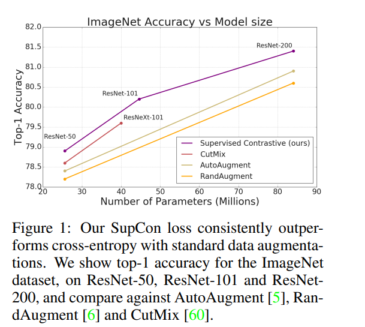
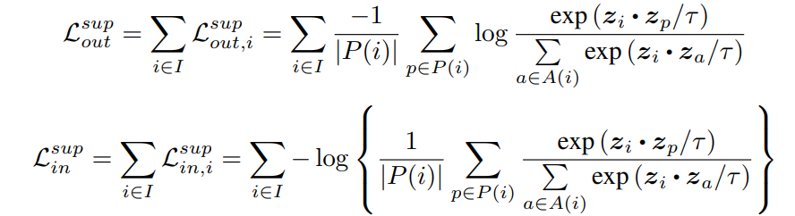
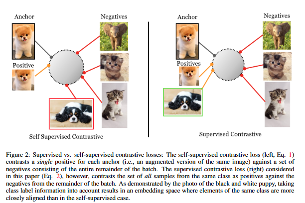

# Supervised Contrastive Learning
## 摘要
近年来，应用于自监督表示学习的对比学习已经复兴，导致了深度图像模型的无监督训练的最新性能。现代批量对比方法包含或显着优于传统的对比损失，例如三元组、最大裕量和 N 对损失。在这项工作中，我们**将自监督批量对比方法扩展到完全监督设置，使我们能够有效地利用标签信息。属于同一类的点簇在嵌入空间中被拉到一起，同时将来自不同类的样本簇推开。我们分析了监督对比 （SupCon） 损失的两种可能版本，确定了损失的最佳公式**。在 ResNet-200 上，我们在 ImageNet 数据集上实现了 81.4% 的 top-1 准确率，比该架构报告的最佳数字高出 0.8%。我们在其他数据集和两个 ResNet 变体上显示出优于交叉熵的一致表现。这种损失显示出对自然损坏的鲁棒性的好处，并且对优化器和数据增强等超参数设置更稳定。我们的损失函数易于实现，引用 TensorFlow 代码发布于 https://t.ly/supcon 。
## 介绍
###  SupCon 损失
交叉熵损失是深度分类模型监督学习中使用最广泛的损失函数。许多研究已经探讨了这种损失的缺点，例如对噪声标签缺乏鲁棒性[64,46]和差余量的可能性[10,31]，从而导致泛化性能降低。然而，在实践中，大多数提出的替代方案对于大规模数据集（如ImageNet[7]）并没有更好的效果，继续使用交叉熵来获得最先进的结果就证明了这一点。下图证明了我们的 SupCon 损失在标准数据增强下的表现始终优于交叉熵。

## Method
### 自监督对比学习（Self Supervised Contrastive Learning）
对于自监督学习，核心是如何给数据自动产生一种标签，然后使用该标签来进行某种“监督学习”。例如：对于无标签的图片，可以把图片随机旋转一个角度 $\alpha$，然后用旋转后的图片作为输入，训练网络来预测图片到底旋转了哪个角度。作为本文涉及到的“自监督对比学习”，它的设定是这样的：
假设一个MiniBatch包含 N 张图片，分别随机对每张图片进行两次Data Augmentation（裁剪、翻转等）处理，每张图片会得出两张新的图片，总共会得出 2N 张新图片，作为后续网络输入进行训练。
经过BackBone Network计算后， 2N 张图片，会产生 2N 个feature ，对每个feature进行normalization处理，使其变为单位向量。这样每个feature就落在了一个半径为1的超球面上(hypersphere)。得到的feature为：{$z_1$,$z_2$,...$z_{2N}$}  。
对于任意一张图片 i ：
* 在其余的 2N-1 张图片中，都存在一张图片 j，图片 i和 j来源于同一张图片（同一张图片随机Augmentation两次，得出的图片 i和j）。因为它们来源于同一张图片，所以让图片i和j 的feature越接近越好。
* 除了图片 i和j ，对于其余的 2N-2张图片，因为它们与图片i来源于不同的图片，所以让它们的feature与图片i的feature越远越好。

可以看出，这种方法的本质是：分别用与图片 i 来源相同的图片的feature、与图片 i 来源不同的图片的feature，跟图片 i 的feature进行对比，然后让来源相同的图片feature越接近，来源不同的图片feature越远。按照这个要求，训练使用如下loss函数来训练模型：
$$
L^{self}=\sum_{i=1}^{2N}L_{i}^{self}
$$
$$
L_i^{self}=-log \frac{exp(z_i*z_{j(i)}/\tau)}{\sum_{i=1}^{2N}1_{i\neq k}*exp(z_i*z_{k}/\tau)}
$$
其中，$\tau$是一个大于0的常数。该loss表示：
对于任意图片 i ：
* 图片 i 和 j 的feature的cos距离越大，loss越小
* 图片 i 与来源不同的其它图片的feature的cos距离的总和，越小越好。

这种方式虽然能学到不错的feature，但有一个不足是：没有考虑到属于同一个类的不同图片之间的feature的相关性。如figure2中左图所示，对于一张图片（左上角），来源相同的图片（左侧下方两张augmentation后的图片）的feature，在超球面上的距离很接近，来源不同的图片之间的feature的距离会比较远。但有一张与左上角图片属于同一类的图片（上图里面的红框图片），他的feature与左上角图片的feature的距离也会很远。

直觉上，同类图片的feature，应该也是越接近越好。但由于“自监督对比学习”的设定里面不使用图片所属的类别信息，所以无法知道哪些图片属于同一类，因此也无法让同类图片的feature彼此距离接近。
### 监督对比学习（Supervised Contrastive Learning）
为了让同类图片的feature彼此接近，需要使用类别信息来判断哪些图片属于同一个类，因此，方法的名字从“自监督”变成了“监督”。对比学习的依据，从“是否来源于同一张图片“，变成了”是否属于同一个类“。训练使用的loss函数变为：

该loss表达的含义是：
对于任意图片 i :
* 与图片i属于同类的所有其它图片的feature，与图片i的feature的cos距离的总和，越大越好。
* 与图片i 不属于同类的所有其它图片的feature，与图片i 的feature的cos距离的总和，越小越好。

从figure2的右图可以看出，同类别的图片的feature，在超球面上的距离，很近；不同类的图片的feature，距离很远。

### SupCon loss
如何在 csl 常用的 InfoNCE loss 的基础上进行扩展，让正例对的范围由“同源图片”扩展成“同类图片”呢？作者设计了两种，一种加权和在 log 外面，一种在里面，实验发现第一种更好。

SupCon loss的特性：
* 对比损失的核心是足够多的负对，以便于与正对形成鲜明的对比，  SupCon loss保留了这一特性。
* 由于增加了正对的数量，SupCon loss可以更好的刻画类内相似性。
* hard样本使得梯度变大，所以更关注hard样本。

## 实验

## 结论
* 对比策略从“同源VS非同源”扩展为“同类VS非同类”，让同类feature接近，异类feature远离
* 对比策略的扩展使得SupCon loss可以更好的刻画类内相似性
* 从梯度公式可以看出更关注hard样本
* 实验表面显著提高了多个数据及的准确率；鲁棒性更好；对超参数更不敏感。